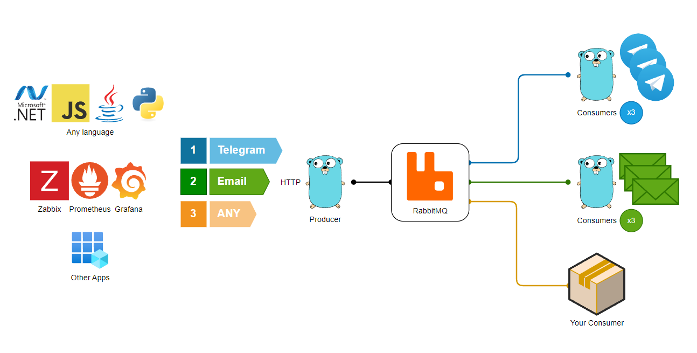
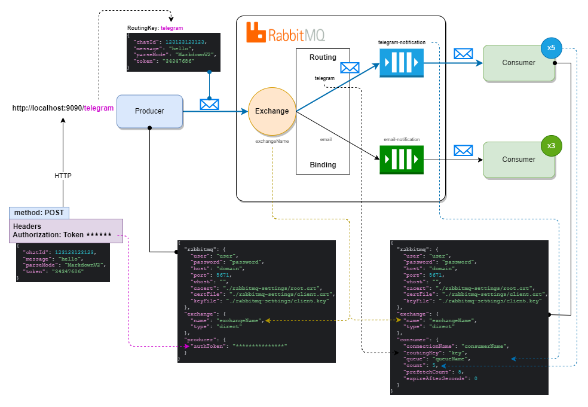
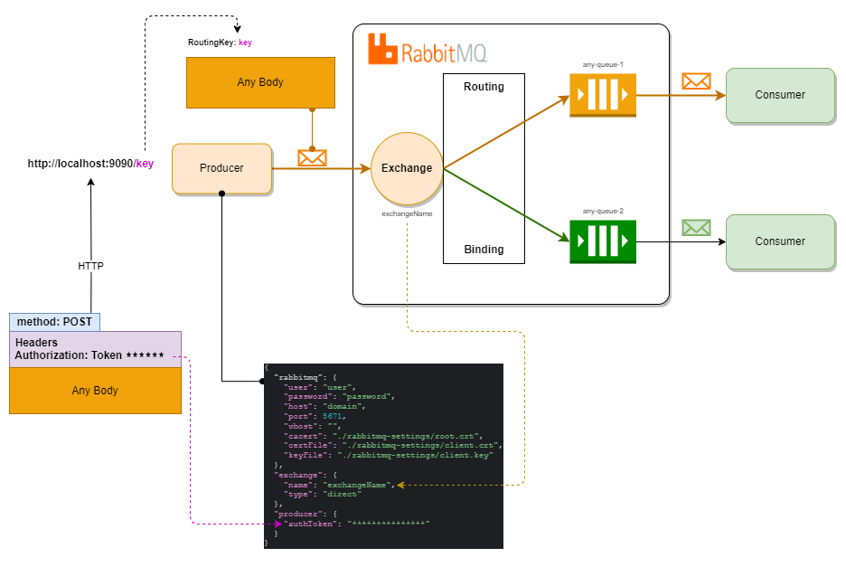

# RMQ Notifier

Утилита для управления очередями сообщений с использованием RabbitMQ

Данный инструмент предназначен для запуска Producer'ов и Consumer'ов в системе RabbitMQ. Он эффективно обрабатывает сообщения, обеспечивая их постепенную передачу для избежания перегрузки и зависания приложений.

Основные возможности:

* Consumer поддерживает отправку уведомлений в Telegram и на Email.
* Обеспечивает плавную передачу уведомлений без резких всплесков нагрузки.
* Идеально подходит для асинхронной отправки уведомлений и писем, что помогает улучшить производительность и стабильность ваших приложений.
* Producer можно использовать для передачи любых сообщений для последующей обработки другими Consumers.



## Схема работы producer-consumer



## Схема работы only-producer

Producer не проверяет тело сообщения, так что можно передавать любые данные



## 1. Настройка

### 1.1. Создание сертификатов


Для работы библиотеки x509 необходимо настроить `subjectAltName`. Для этого добавьте в файл `/etc/ssl/openssl.conf`
блок `alt_names` где будут альтернативные домены. Обязательно укажите основной домен, так как subjectAltName
переопределяет полностью CN.

```ini
[ alt_names ]
DNS.1 = server1.example.com
DNS.2 = mail.example.com
DNS.3 = www.example.com
DNS.4 = www.sub.example.com
DNS.5 = mx.example.com
DNS.6 = support.example.com

[ v3_ca ]
# Подключаем
subjectAltName = @alt_names
...
```

Создать файлы сертификатов для сервера и клиента можно через скрипт `rabbit-settings/create-certs.sh`

```shell
bash rabbit-settings/create-certs.sh 'rabbitHost' 'rabbitUser';
```

Скрипт создаст 5 файлов:

- `server.key`: Этот файл содержит закрытый ключ (private key) сервера. 
    Этот ключ используется для подписания запроса на сертификат и для создания подписанного
    самоподписанного серверного сертификата.
- `server.crt`: Самоподписанный серверный сертификат. Этот файл содержит открытый ключ сервера,
    данные о сервере и подпись, сгенерированную закрытым ключом сервера. Он используется 
    сервером для установки защищенного соединения.
- `root.crt`: Корневой сертификат (cacert). В данном случае, этот файл представляет
    собой самоподписанный корневой сертификат, который используется для подписи клиентских сертификатов.
    Этот файл может быть распространен среди клиентов для проверки подлинности сервера.
- `client.key`: Закрытый ключ (private key) клиента. Этот ключ используется для создания 
    запроса на подпись сертификата клиента и для создания подписанного клиентского сертификата.
- `client.crt`: Подписанный клиентский сертификат. Этот файл содержит открытый ключ клиента, 
    данные о клиенте и подпись, сгенерированную закрытым ключом сервера (root key).

Для запуска rabbitmq будут необходимы `server.key`, `server.crt`, `root.crt`.

Для подключения клиента - `root.crt`, `client.key`, `client.crt`.

### 1.2. Файл конфигурации

Для работы приложения требуется настроить файл конфигурации `config.json`.

Через переменную окружения `CONFIG_FILE` можно указать, где искать файл конфигурации,
по умолчанию - `/etc/rmq-notifier/config.json`

Каждое значение файла конфигурации можно переопределить через переменную окружения. 

Список переменных окружения:

    RABBITMQ_USER
    RABBITMQ_PASSWORD
    RABBITMQ_HOST
    RABBITMQ_PORT
    RABBITMQ_VHOST
    RABBITMQ_CACERT
    RABBITMQ_CERTFILE
    RABBITMQ_KEYFILE
    EXCHANGE_NAME
    EXCHANGE_TYPE
    CONSUMER_CONNECTION_NAME
    CONSUMER_ROUTING_KEY
    CONSUMER_QUEUE
    CONSUMER_COUNT
    CONSUMER_PREFETCH_COUNT
    CONSUMER_EXPIRE_AFTER_SECONDS
    PRODUCER_AUTH_TOKEN

    # Для email consumer (подключение к почтовому серверу)
    EMAIL_NOTIFIER_HOST
    EMAIL_NOTIFIER_PORT
    EMAIL_NOTIFIER_LOGIN
    EMAIL_NOTIFIER_PASSWORD

`expireAfterSeconds` указывает время в секундах спустя которое сообщения для consumer будут
пропущены и помечены как Acknowledge.


## 2. Запуск

### 2.1. Отправка через producer

Запускаем приложение на конкретном порту

```shell
notifier producer 0.0.0.0:9090
```

Далее отправляем POST запрос на URL `/<routingKey>`.

```bash
curl -X POST "http://localhost:9090/telegram" \
-H "Authorization: Token ********" \
-H "Content-Type: application/json" \
-d '{
  "chatId": 123123123,
  "message": "hello",
  "parseMode": "MarkdownV2",
  "token": "****"
}'

```

Каждый запрос должен содержать заголовок с токеном, который указан в файле конфигурации,
либо через переменную окружения `PRODUCER_AUTH_TOKEN`
```json
"producer": {
  "authToken": "834932789472389478923"
}
```

### 2.2. Обработка через consumer


```shell
notifier consumer telegram
```

- параметр `consumer` запускает приложения для приема сообщений;
- `telegram` это тип уведомителя, который должен обработать сообщение.
Доступны: `telegram`, `email`.

### 2.2.1. Telegram

Для уведомителя `telegram` тело сообщения должно быть в следующем JSON в формате:

```json
{ 
  "chatId": 123123123,
  "message": "hello", 
  "parseMode": "MarkdownV2",
  "token": "****"
}
```

### 2.2.2. Email

Для уведомителя `email` тело сообщения должно быть в следующем JSON в формате:

```json
{
  "sender": "user@mail.com",
  "to": [
    "to-user1@mail.com",
    "to-user2@mail.com"
  ],
  "subject": "test",
  "body": "<h1>test</h1>"
}
```

> [!IMPORTANT]
> Для работы `email` уведомителя необходимо в файле конфигураций указать настройки для подключения,
> либо через переменные окружения:

```json
{
  "emailNotifier": {
    "host": "mail.domain",
    "port": 587,
    "login": "user",
    "password": "password"
  }
}
```
